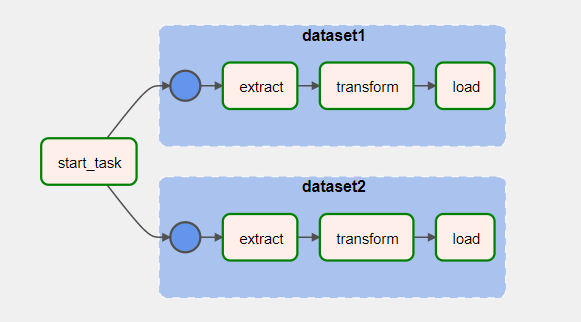

## Section 1: Data Pipelines

### Approach
To set up steps of the data pipeline as tasks of an Airflow DAG, with a schedule to run at 0100hrs daily.

### DAG Details
* DAG Name: daily_data_processing_pipeline
* DAG Schedule: 0 1 * * *

### Task Group Details
| Task Group Name | Task Group Description |
| --- | --- |
| dataset1 | ETL steps for `dataset1.csv` |
| dataset2 | ETL steps for `dataset2.csv` |

### Task Details
| Task Name | Task Description |
| --- | --- |
| start_task | logs start time information |
| extract | reads csv file |
| transform | performs transformation on dataset as per assessment requirements |
| load | saves transformed dataset |

### DAG Diagram


### Run
To intialise airflow for the first time, cd to this folder (folder `docker-compose.yml`) and execute the following command (in WSL for Windows):
```
mkdir -p ./dags ./logs ./plugins
echo -e "AIRFLOW_UID=$(id -u)\nAIRFLOW_GID=0" > .env
docker-compose up airflow-init
```

Subsequently, we can start airflow by executing the following command:
```
docker-compose up
```

Set up python virtual environment and install the required packages by running the following commands:
```
conda create -n datapipeline python=3.8 -y
conda activate datapipeline
pip install -r requirements.txt
```

Execute the following commands to set up the required DAG:
```
cd dags
python dag_schedule.py
```

### Output
The output files can be found [here](dags/output/).

### References
https://airflow.apache.org/docs/apache-airflow/2.1.3/start/docker.html

https://tegardp.medium.com/the-6-step-etl-process-using-airflow-with-example-and-exercise-db46715a61f0