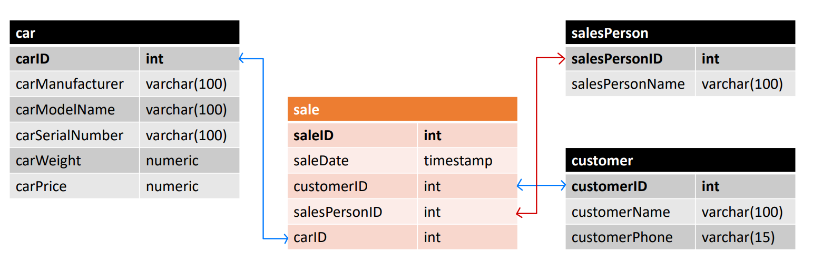

## Section 2: Databases

### Database Details
Database Name: carSales

### Table Details
| Table Name | Table Description | Remarks |
| --- | --- | --- |
| car | `[carID]` - Unique ID<br>`[carManufacturer]` – Manufacturer of the car product<br>`[carModelName]` – Model Name of the car product<br>`[carSerialNumber]` – Serial Number of the car product<br>`[carWeight]` – Weight of the car product<br>`[carPrice]` – Price of the car product | Note: check for unique between `carManufacturer`, `carModelName` and `carSerialNumber`; `carPrice` and `carWeight` are more than 0 |
| salesPerson | `[salesPersonID]` - Unique ID<br>`[salesPersonName]` – Name of the sales person |
| customer | `[customerID]` - Unique ID<br>`[customerName]` – Name of the customer<br>`[customerPhone]` – Phone Number of the customer<br> |
| sale | `[saleID]` - Unique ID<br>`[saleDate]` – Timestamp of sale (default entry: current time)<br>`[customerID]` – unique ID of customer<br>`[salesPersonID]` – unique ID of sales person<br>`[carID]` – unique ID of car<br> | Note: check that `saleDate` is before current time |

### Entity-Relationship Diagram


### Run
To run the database, cd to this folder (folder containing `Dockerfile` and `docker-compose.yml`) and execute the following command:
```
docker-compose up
```
Note that current setup is configured to show the output of the two queries as per assessment requirement.

To run additional queries, execute the following command and perform queries in the psql cli:
```
docker exec -it sales-postgres-db-container psql -U postgres -d carSales
```

### Query Output
1:
```
sales-postgres-db-container | /usr/local/bin/docker-entrypoint.sh: running /docker-entrypoint-initdb.d/query1.sql
sales-postgres-db-container | 2022-09-30 17:57:10.855 UTC [67] LOG:  statement: SELECT customer.customerName AS Customer, COALESCE(SUM(car.carPrice),0) AS Spending
sales-postgres-db-container |   FROM customer LEFT OUTER JOIN sale ON sale.customerID=customer.customerID
sales-postgres-db-container |   LEFT OUTER JOIN car ON sale.carID=car.carID
sales-postgres-db-container |   GROUP BY customer.customerID, customer.customerName;
sales-postgres-db-container |       customer       | spending
sales-postgres-db-container | ---------------------+----------
sales-postgres-db-container |  Lucien Tunnow       | 43519.08
sales-postgres-db-container |  Willie Gadsby       |        0
sales-postgres-db-container |  Christos Worsnop    |  31078.0
sales-postgres-db-container |  Jemimah Mitten      | 66586.62
sales-postgres-db-container |  Wendeline Rumbellow | 34306.15
sales-postgres-db-container |  Sara-ann Rumbellow  | 29410.87
sales-postgres-db-container |  Gypsy Bruckmann     |        0
sales-postgres-db-container |  Marion Fiske        | 71317.90
sales-postgres-db-container |  Phaidra Rillatt     | 35584.82
sales-postgres-db-container |  Grayce Starrs       |        0
sales-postgres-db-container |  Steven Pluthero     |        0
sales-postgres-db-container |  Luella Blunn        | 78207.10
sales-postgres-db-container |  Tamas Gawthorpe     | 76795.06
sales-postgres-db-container |  Linette Griswaite   |        0
sales-postgres-db-container |  Adore Tindall       | 32049.89
sales-postgres-db-container | (15 rows)
```

2:
```
sales-postgres-db-container | 2022-09-30 17:57:10.888 UTC [69] LOG:  statement: SELECT car.carManufacturer as Manufacturer, COUNT(*) AS Sales
sales-postgres-db-container |   FROM car LEFT OUTER JOIN sale ON sale.carID=car.carID
sales-postgres-db-container |   WHERE sale.saleDate>=date_trunc('month', CURRENT_DATE)
sales-postgres-db-container |   GROUP BY car.carManufacturer
sales-postgres-db-container |   ORDER BY Sales DESC
sales-postgres-db-container |   LIMIT 3;
sales-postgres-db-container |  manufacturer | sales
sales-postgres-db-container | --------------+-------
sales-postgres-db-container |  Mazda        |     2
sales-postgres-db-container |  Ford         |     1
sales-postgres-db-container |  Infiniti     |     1
sales-postgres-db-container | (3 rows)
```

<br>

### References
1. Logging queries and output in docker run: https://stackoverflow.com/questions/57015003/log-all-queries-in-the-official-postgres-docker-image
2. Initialise PostgreSQL with docker compose 
https://levelup.gitconnected.com/creating-and-filling-a-postgres-db-with-docker-compose-e1607f6f882f
3. Using docker compose based on Dockerfile: https://www.educative.io/blog/docker-compose-tutorial
4. Generate mock data: https://www.mockaroo.com/