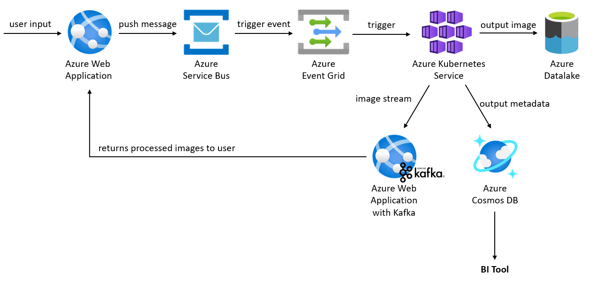

## Section 3: System Design

### Architecture Diagram

### Workflow
1. User uploads image(s) through the Azure Web Application. 
2. The image(s), together with user metadata, gets pushed as message into Azure Service Bus.
3. Message in Azure Service Bus triggers an event in Azure Event Grid.
4. Azure Event Grid sends a notification that triggers Kubernetes Service.
5. Kubernetes Service, which hosts the scripts for image processing, process the image(s) and stores processed image(s) into Azure Datalake. Metadata (both user metadata and image metadata) are stored in Azure Cosmos DB.
6. Processed images are also sent to another web application integrated with a Kafka stream for the user to consume.

### Components
* **Azure Web Application**: Platform for user to upload image(s) and receive processed image(s). Backend is able to connect to Azure Service Bus and receive from Kafka stream.
* **Azure Service Bus**: Platform with message queues, where messages contain image(s) uploaded by user.
* **Azure Event Grid**: Triggers an event when a new message is pushed into Azure Service Bus.
* **Azure Kubernetes Service**: Cluster management for virtual machines that run containerized services. It manages the compute target used to host image processing script and process image(s) based on message from Azure Service Bus. Service can be integrated with load balancer and autoscaling for more optimised processing performance.
* **Azure Datalake**: Unstructured storage sink to store the processed images. Soft deletion with a retention period of 7 days can be set to ensure that images stored will be kept for a minimum of 7 days (and can be restored even if deleted). 
    * Note: Lifecycle management rule can also be set to delete files based on a retention period to reduce cost.
* **Azure Cosmos DB**: NoSQL database to store metadata for each batch of image(s) processed, including metadata of user who uploaded the image(s). Business Intelligence tools can be connected to this database to analyse key statistics of images processed. 
    * Note: Since user can upload more than 1 image at a time, metadata of each batch of image(s) would not be structured, hence NoSQl would be more suitable to store this data.

### Assumptions
* Images uploaded by users can be compressed / would not be too big in size.

### References
1. Azure Service Bus: https://learn.microsoft.com/en-us/azure/service-bus-messaging/service-bus-messaging-overview
2. Image classification on Azure: https://learn.microsoft.com/en-us/azure/architecture/example-scenario/ai/intelligent-apps-image-processing