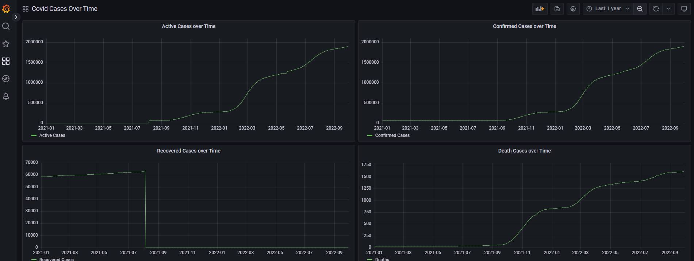

## Section 4: Charts and APIs

### Approach
To set up instances of PostgreSQL and Grafana via Docker to use as data sink and visualisation tool respectively. Run python script to ingest data into PostgreSQL from day 1 till current date (subsequent runs of the script will only ingest data not in database).

### Grafana Dashboard Screenshot


### Run
To intialise postgresql and grafana, cd to this folder (folder containing `docker-compose.yml`) and execute the following command (in WSL for Windows):
```
docker-compose up
```

Set up python virtual environment and install the required packages by running the following commands:
```
conda create -n chartsapi python=3.8 -y
conda activate chartsapi
pip install -r requirements.txt
```

Execute the following commands to ingest data into postgresql database:
```
cd script
python api_request.py
```

### Visualisation
* Navigate to the grafana page via http://localhost:3008
* Set up PostgreSQL as a data source
* Import [json model](ui/grafana-dashboard.json) as a dashboard
* Visualise by modifying the time filter at the top right of the page
