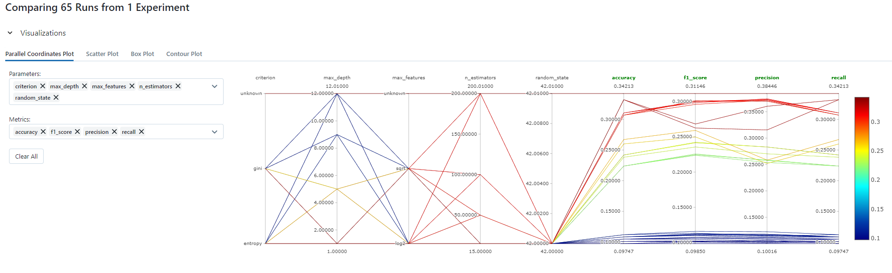

## Section 5: Machine Learning

### Approach
To perform training of ML model and monitoring hyper-parameter tuning via MLFlow.

### MLFlow Experiment Tracking


### Run
To set up python virtual environment and install the required packages, cd to this folder and execute the following command:
```
conda create -n machine_learning python=3.8 -y
conda activate machine_learning
pip install -r requirements.txt
```

Initialise MLFlow via the commands below and navigate to web UI page via http://localhost:5000
```
mlflow ui --backend-store-uri file:///C:/Users/ongji/Documents/GitHub/Data-Engineer-Tech-Challenge/05_machine_learning/notebooks/mlruns
```

Run notebooks [01_data_preprocessing.ipynb](notebooks/01_data_preprocessing.ipynb) and [02_training.ipynb](notebooks/02_training.ipynb) to process the raw input data and perform training integrated with MLFlow monitoring.

Execute the following commands to ingest data into postgresql database:
```
cd script
python api_request.py
```

### Model Prediction
Execute the following command to obtain predicted `buying` based on input arguments. Note: script takes in 6 arguments as inputs, and if any are missing, it would attempt to make use of the remaining inputs, together with the raw data, to get a value to be used as the missing input.
```
python predict.py --maint high --doors 4 --lug_boot big --safety high --class good
```

Output message
```
{'maint': 'high', 'doors': '4', 'persons': None, 'lug_boot': 'big', 'safety': 'high', 'class': 'good'}
missing input values: persons
searching for other rows with the same values for the remaing columns: maint,doors,lug_boot,safety,class
no other rows with the same values... proceeding to the mode of all rows for columns: persons
  maint doors persons lug_boot safety class
0  high     4       2      big   high  good

Buying price is predicted to be low
```

### References
1. Starting MLFlow on local machine: https://stackoverflow.com/questions/71708147/mlflow-tracking-ui-not-showing-experiments-on-local-machine-laptop
2. Getting run based on with filter on metrics: https://www.mlflow.org/docs/latest/search-runs.html